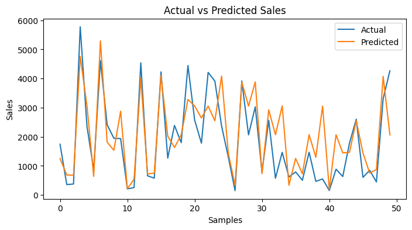

# BigMart Sales Prediction

This project aims to build a machine learning model to predict sales for products across different BigMart outlets. Using historical sales data, the model analyzes factors such as product attributes, store characteristics, and pricing to estimate sales performance.

The model is implemented using XGBoost Regressor (XGBRegressor), with a focus on data preprocessing, feature engineering, and model evaluation.

---

## 🚀 Key Features
- Data cleaning and preprocessing
- Feature engineering and transformation
- Sales prediction using XGBoost
- Model evaluation and performance analysis

---

## 🛠️ Tech Stack
- Python
- Pandas, NumPy
- Matplotlib
- XGBoost
- Joblib

---

## 📈 Model Output

### Actual vs Predicted Sales

---

## 📌 Summary
The model demonstrates the ability to capture patterns in sales data and generate predictions close to actual values, showcasing the effectiveness of gradient boosting techniques for regression problems.